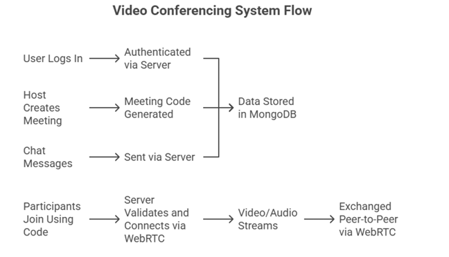

# 🎥 ConvoSpace – Video Conferencing Software

## 📌 Overview
**ConvoSpace** is a web-based video conferencing application designed to enable seamless real-time communication. It allows users to connect through video, audio, and chat features, making it suitable for online meetings, virtual classrooms, and collaboration.

This project was developed as a mini project for the **Bachelor of Engineering (Information Technology)** under **Savitribai Phule Pune University, Pune**.

---

## 🚀 Features
- 📹 Real-time Video Calling  
- 🎤 Audio Communication  
- 💬 Live Chat Messaging  
- 👥 Multi-user Meeting Support  
- 🔗 Room-based Connection System  
- 🌐 User-friendly Interface  

---

## 🛠️ Tech Stack
- **Frontend:** HTML, CSS, JavaScript, React.js
- **Backend:** Node.js, Express.js , JWT Authentication
- **Real-time Communication:** WebRTC, Socket.IO  
- **Database:** MongoDB 

---

## 🏗️ System Architecture


---
## 📂 Project Structure

### Backend Structure

```
backend/
│
├── node_modules/
│
├── src/
│   ├── contexts/
│   │
│   ├── controllers/
│   │   ├── socketManager.js
│   │   ├── user.controller.js
│   │
│   ├── models/
│   │   ├── meeting.model.js
│   │   ├── users.model.js
│   │
│   ├── routes/
│   │   ├── users.routes.js
│   │
│   ├── app.js
│
├── package.json
├── package-lock.json
```
### Frontend Structure
```
frontend/
├── node_modules/
├── public/
├── src/
│   ├── contexts/
│   │   └── AuthContext.jsx
│   ├── pages/
│   │   ├── authentication.jsx
│   │   ├── history.jsx
│   │   ├── home.jsx
│   │   ├── landing.jsx
│   │   └── VideoMeet.jsx
│   ├── styles/
│   │   └── videoComp.css
│   ├── utils/
│   ├── App.css
│   ├── App.js
│   ├── App.test.js
│   ├── environment.js
│   ├── index.css
│   ├── index.js
│   ├── logo.svg
│   ├── reportWebVitals.js
│   └── setupTests.js
├── package-lock.json
└── package.json
```
